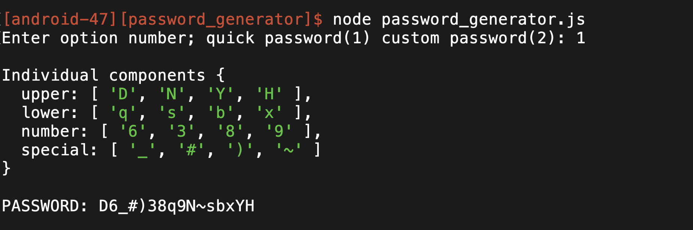
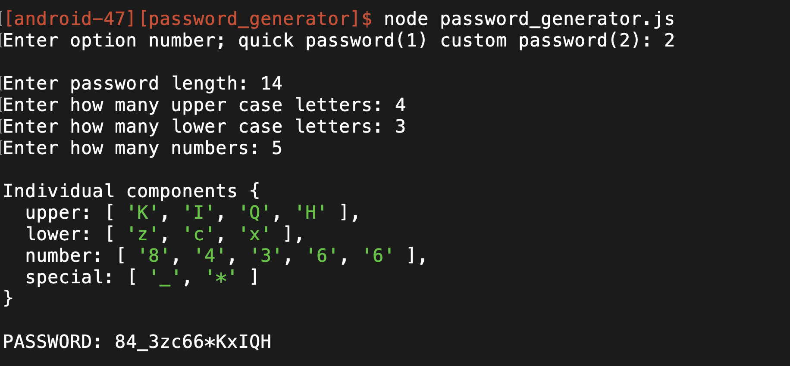

# Password Generator

By Javier Garcia Ramirez (android-47)
Wed. Mar 24, 2021

### FEATURES
* User can select to generate a quick password or a password where the components are custumizable
* User can select password components including length (up to 100), number of upper/lower case letters, numbers, and special characters
* Random characters are randomly dispersed throughout the password
* Error handles all bad input by displaying error message and prompting the user again
* Automatically calculates the number of special characters since the length is given
* Displays password individual components as a group at the end

## GAMEPLAY
### Quick 16 Character Password

### Custom Password


### DESCRIPTION
This program that allows the user to generate custom complex passwords. Random characters are randomly dispersed throughout the password, meaning all the lower case letters are not bunched up or the numbers are not bunched up, etc. The user is able to choose between a quick password, where the components include 16 characters in length including 4 upper/lower case letters, 4 numbers, and 4 special characters, OR the user can decide to generate a custom password. The custom password allows the user to decide all components such as the on the length, up to 100, and how many upper/lower case letters, numbers, and special characters. At the end, the program displays the password as well as the individual components to show the user the password generated satisfies all the requirements.


### STEPS ON HOW TO RUN THE PROGRAM
1. Make you have the node_modules folder included from this repository in order to run the program using JavaScript (ES6).
2. Enter the following line on the terminal command line:    


```
node password_generator.js
```